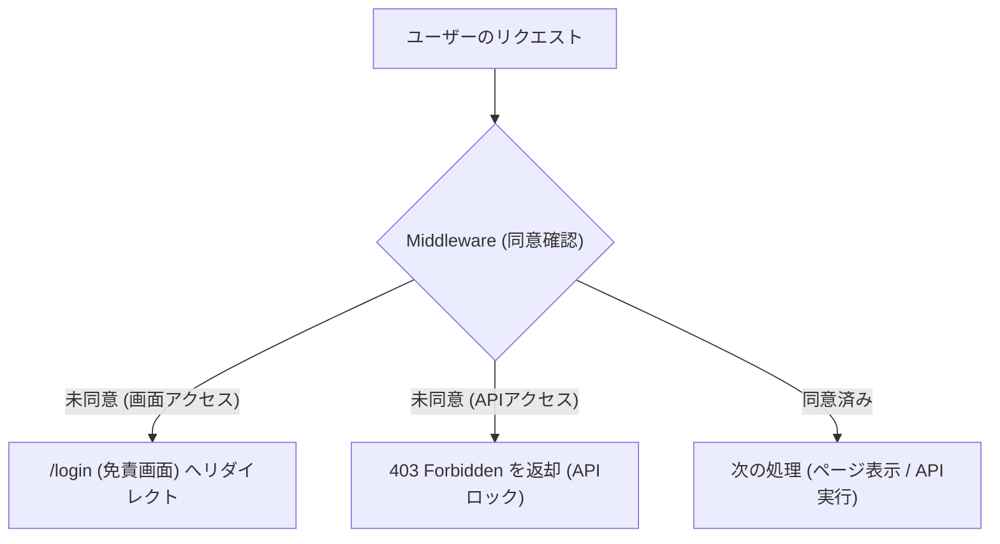
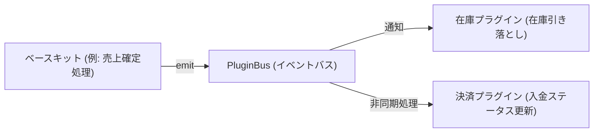

# コンポーザブル・マルチ業務システム - 開発計画書

本ファイルは、共通のベースキットと個別の機能プラグインを疎結合に組み合わせ、部門ごとの単機能システムを構築・統合するための仮開発計画書です。開発時は本ファイルを参照し、進捗を同期してください。

---

## 1. プロジェクト概要 ＆ ゴール

*   **開発の目的**：知人からの開発依頼や相談に備え、顧客・在庫・売上・仕入・見積・決済を一元管理する業務の非効率およびデータの不整合課題を解決するためにシステムを作る。
*   **成果物**：スイッチ一つで店舗・小売型（RETAIL）とBtoB・受注型（BTOB）の双方にシステム全体の表示と挙動を自動で着せ替え可能な、JavaScript（Next.js + PostgreSQL）ベース of 統合業務システム。
*   **防衛方針**：完全自己完結型（利用者の無料環境で動かす）。他人の個人情報は一切預からず、情報漏洩リスクおよびサーバーコスト負担を制作者側で100%ゼロにする。また、データ誤消去を防ぐ「論理削除」、連打を防ぐ「二重送信ガード」、DBレベルでの伝票番号「物理UNIQUE制約（論理削除レコードを除く）」の多重ガードを敷き、データ不整合による損害賠償リスクや夜間の呼び出しトラブルをシステム・運用面で100%遮断する。

---

## 2. システムアーキテクチャ（疎結合設計）

本システムは、**「共通化できる機能だけの骨組み（ベースキット）」**の上に、細分化された**「4つの機能プラグイン」**をマウントすることで、4つの部門システムを構築し、それらを疎結合に連携させます。

### 2.1. 共通の土台：ベースキット（BaseKit Core）
すべての部門システムで共通化できるインフラ・防衛・共通UI機能です。
1.  **共通UIレイアウト（ガワ）**：ヘッダー、サイドバー枠、画面遷移ルーティング。
2.  **免責ライセンスゲート**：起動時に承諾書への完全同意を強制し、未同意アクセスをMiddleware層で一括遮断。
3.  **100%自動操作ログ（監査トレール）**：PostgreSQLのトリガー関数を用いて、データ変更（CREATE, UPDATE, DELETE）を24時間監視し自動記録。
4.  **プラグイン接続部（PluginBus）**：メモリ内での非同期並列イベント通信ハブ。
5.  **APIゲートウェイ・セキュリティ**：二重送信防止（`Idempotency-Key`）、JSONBカスタムフィールド防衛バリデーション（サイズ・ネスト制限）。

### 2.2. マウントされる「4つの機能プラグイン」
ベースキットの上に載せる、部門固有の業務ロジックです。

1.  **「顧客・見積・売上」機能プラグイン**（営業・販売部門用）：
    *   顧客基本情報（氏名、連絡先）の管理（JSONBカスタムフィールド対応）。
    *   見積書の作成、売上伝票入力、見積から売上へのワンクリック変換機能。
2.  **「仕入」機能プラグイン**（購買・調達部門用）：
    *   仕入伝票の入力、および仕入履歴管理。
3.  **「在庫」機能プラグイン**（倉庫・物流・店舗部門用）：
    *   商品コード・単価（販売/仕入）の基本管理。
    *   論理在庫・物理在庫の管理および不整合チェック。
4.  **「決済」機能プラグイン**（経理・財務部門用）：
    *   売上・仕入トランザクションに伴う決済ステータス（未入金/入金済、未払/支払済）の管理と消込。

### 2.3. 社長の機能：総合マスター（経営ダッシュボード＆CSV）
4つの部門システムを横断し、会社全体のデータを統括・可視化するマスター管理機能です。
*   **経営ダッシュボード**：SQLの直接集計（SUM / GROUP BY）によりデータを二重管理せず、リアルタイムに粗利（売上高 － 仕入原価）および滞留債権（未入金警告）を表示する。
*   **セルフサービスCSV**：税理士提出用データ等を、画面からクライアントサイド（Excel形式）で瞬時に抽出・ダウンロードする。

---

## 3. ビジネスモード着せ替え仕様（モジュールA）

環境変数（`NEXT_PUBLIC_BUSINESS_MODE`）の切り替えにより、システム全体のUI表示および各機能プラグイン間のイベント連動タイミングを自動で着せ替えます。

### 3.1. 店舗・小売型（RETAIL）モード時の挙動
*   **営業・販売**：「見積」機能はUIから自動的に隠されます。「売上登録」がメイン業務となります。
*   **連動処理**：売上登録が発生した瞬間、`PluginBus` を介して「在庫」プラグインが即時在庫を引き落とし、「決済」プラグインも即時入金完了（CASH）として自動処理されます。
*   **社長ダッシュボード**：売上と同時に「確定した粗利」がリアルタイムに表示され、未入金警告（滞留アラート）は表示されません。

### 3.2. BtoB・受注型（BTOB）モード時の挙動
*   **営業・販売**：「見積書作成」から業務をスタートし、確定後に「売上（受注）」へ変換します。
*   **連動処理**：売上確定段階では「未出荷・未入金」となり、倉庫部門が「出荷完了」を入力した時点で在庫が引き落とされます。
*   **決済消込**：経理部門が銀行振込などを確認し、一覧画面から手動で「入金消込（PAID）」を行います。
*   **社長ダッシュボード**：入金が消し込まれるまで、ダッシュボードに「滞留債権警告（未入金アラート）」が常時警告表示され、社長が回収遅れを監視できます。

---

## 4. 公開・実証計画（2つの組み合わせパッケージ）

ベースキットと上記4つの機能プラグインが先行して完成している前提の下、組み合わせパターンを変えた以下の2つのパッケージを公開することで、「着脱可能なコンポーザブル設計の過程と実績」を明快に実証します。

### パッケージ①：2部門版（営業 ✕ 倉庫）
*   **構成**：ベースキット ＋ **「顧客・見積・売上」プラグイン** ＋ **「在庫」プラグイン**。
*   **実証**：営業活動（売上）と倉庫（在庫引き落とし）が、コードを書き換えることなく自動的に疎結合連動する様子を公開・検証します。

### パッケージ②：4部門版（フルパッケージ）
*   **構成**：ベースキット ＋ **「4つの機能プラグインすべて」** ＋ **「経営ダッシュボード＆CSV」**。
*   **実証**：仕入、決済、および会社全体を統括する「社長のダッシュボード（マスター）」を組み合わせた、完全な統合業務システムとして動作検証・公開します。

---

## 5. フォルダ・ファイル構成案

```plaintext
my-modular-basekit/
├── PROJECT_PLAN.md            # 本計画書（開発同期用）
├── BASEKIT_SPECIFICATION.md   # 共通設計パターン＆防衛アーキテクチャ仕様書
├── README.md                  # 導入・運用マニュアル
├── schema.sql                 # DB設計図（共通PostgreSQL）
├── .env.example               # 環境変数（ビジネスモード切り替え設定）
├── check-no-network.js        # 外部通信混入チェッカー
│
├── ai_pipeline/               # ★【パイプライン連携用成果物フォルダ】
│   ├── result.json            # 実行結果（自動出力）
│   ├── test_report.md         # テスト結果（自動出力）
│   ├── log.md                 # 開発ログ・判断記録（自動出力）
│   └── development_chat_history.md # 開発チャット履歴（自動出力）
│
├── src/
│   ├── lib/                   # バックエンド共通ロジック
│   │   ├── db.ts              # DB接続設定
│   │   └── plugin-bus.ts      # メモリ内イベント中継器（PluginBus）
│   │
│   ├── app/                   # 画面 ＆ API ルート (ベース側)
│   │   ├── page.tsx           # 社長のダッシュボード（モジュールBと連携）
│   │   ├── login/
│   │   │   └── page.tsx       # 免責同意ゲート（二重ロック）
│   │   └── api/
│   │       └── audit-logs/
│   │           └── route.ts   # 操作ログAPI
│   │
│   ├── components/            # 画面共通部品
│   │   ├── csv-exporter.tsx   # セルフサービスCSV出力
│   │   └── custom-fields.tsx  # JSONBカスタムフィールドUI
│   │
│   └── plugins/               # ★マウントされる機能プラグイン
│       ├── sales-crm/         # ①「顧客・見積・売上」機能プラグイン
│       ├── procurement/       # ②「仕入」機能プラグイン
│       ├── inventory/         # ③「在庫」機能プラグイン
│       └── finance/           # ④「決済」機能プラグイン
```

---

## 6. 工程管理票（進捗ステータス管理）

*   **全体進捗率**: ░░░░░░░░░░ 0% (0/15 ステップ完了)
*   **最終更新日**: 2026年6月30日

| フェーズ | ステップ | タスク内容 | 対象ファイル | ステータス | 担当 |
| :--- | :--- | :--- | :--- | :--- | :--- |
| **P1: 準備** | 1-1 | フォルダ・ファイル構成の確定 | `PROJECT_PLAN.md` | **[未着手]** | AI/自分 |
| | 1-2 | 環境変数・共通設定ファイルの定義 | `.env.example`, `.cursorrules` | **[未着手]** | AI |
| **P2: 裏側** | 2-1 | データベーススキーマと接続作成 | `schema.sql`, `src/lib/db.ts` | **[未着手]** | AI |
| | 2-2 | 免責ゲート＆API二重ロック作成 | `src/middleware.ts`, `/login` | **[未着手]** | AI |
| | 2-3 | 基本監査ログ連携とPluginBus作成 | `src/lib/plugin-bus.ts`, `api/audit-logs/route.ts` | **[未着手]** | AI |
| **P3: プラグイン** | 3-1 | 「顧客・見積・売上」機能プラグイン実装 | `src/plugins/sales-crm/` | **[未着手]** | AI |
| | 3-2 | 「仕入」機能プラグイン実装 | `src/plugins/procurement/` | **[未着手]** | AI |
| | 3-3 | 「在庫」機能プラグイン実装 | `src/plugins/inventory/` | **[未着手]** | AI |
| | 3-4 | 「決済」機能プラグイン実装 | `src/plugins/finance/` | **[未着手]** | AI |
| **P4: 画面・統合** | 4-1 | メイン画面（社長ダッシュボード）UIの構築 | `src/app/page.tsx` | **[未着手]** | AI |
| | 4-2 | カスタムフィールド設定・CSV出力部品の作成 | `components/` | **[未着手]** | AI |
| | 4-3 | ビジネスモード着せ替え連動処理 of 結合テスト | `src/lib/plugin-bus.ts` | **[未着手]** | AI |
| **P5: 仕上げ** | 5-1 | 2部門版および4部門版の動作検証（パッケージ化） | - | **[未着手]** | AI/自分 |
| | 5-2 | 使い方マニュアル（README）の作成 | `README.md` | **[未着手]** | AI |
| | 5-3 | 本番デプロイと不要データ消去 | `README.md` 内チェックリスト | **[未着手]** | AI/自分 |
| **P6: 成果物** | 6-1 | パイプライン連携用成果物の自動出力 | `ai_pipeline/` | **[未着手]** | AI |


---

## 7. 運用アセット：ソフトウェア利用に関する承諾書（テンプレート）

```plaintext
【ソフトウェア利用に関する承諾書】

本ソフトウェア（以下「本システム」という）は、個人の練習・ホビーの一環として無償（または実費）で提供される試作品です。

（無保証） 利用者は、本システムに不具合やバグが存在する可能性があることを理解し、現状有姿で利用するものとします。
（免責） 制作者は、本システムの利用、または利用不能によって生じた損害（データの消失、業務の中断、営業利益の損失などを含むがこれらに限定されない）について、一切の法的責任および賠償責任を負わないものとします。
（ライセンス） 本システムの著作権は制作者に帰属し、MITライセンスに基づいて提供されます。

署名日：2026年 ＿月 ＿日
利用者氏名（サイン）：＿＿＿＿＿＿＿＿＿＿＿
```

---

## 8. 現在地と次回のタスク
* **【現在地】**：フェーズ1：ステップ 1-1「フォルダ・ファイル構成の確定」
* **【次回タスク】**：開発対象フォルダのセットアップおよび環境変数ファイルの定義。

---
---

# PART 2: 共通設計パターン ＆ 防衛アーキテクチャ仕様書 (BASEKIT_SPECIFICATION.md)

本仕様書は、手離れが良く、トラブルの起きない頑丈なWebシステム（特に知人や中小規模のクライアント向けシステム）を構築する際の**防衛設計パターン**および**再利用可能なアーキテクチャ**を定義したものです。

---

## 1. 本仕様書の趣旨とAIへのプロンプト例

### 趣旨
AI共同開発においては、同じ防衛的コンセプト（免責同意の強制、確実な操作ログ、拡張性の確保）を毎回ゼロから再発明するのではなく、本ドキュメントに記載された標準コードパターンと設計ルールに準拠することで、ブレのない堅牢なシステムを短期間で構築します。

### AIへのプロンプト（新規プロジェクト用テンプレート）
> **[AIへの指示]**
> 新しいプロジェクト 統合型マルチ業務システム を開始します。
> 設計・実装にあたっては、添付した `BASEKIT_SPECIFICATION.md` の「防衛設計パターン」および「再利用アーキテクチャ」に完全に準拠してください。
> 特に以下の防衛設計を必ず初期フェーズで組み込んでください：
> 1. 免責ゲートとMiddlewareによる二重ロック
> 2. PostgreSQLセッション変数とトリガーを用いた100%自動操作ログ
> 3. JSONBカスタムフィールドのセキュリティバリデーション
> 4. イベント駆動のノンブロッキング・プラグインバス
> 5. APIの二重送信防止（Idempotency Key）

---

## 2. 免責ゲート ＆ 二重ロック仕様（自己防衛ゲート）

利用開始時に法的リスクを回避するための免責同意画面を表示し、同意していないユーザーによるアクセス（API直接実行を含む）を二重に遮断します。



### 技術仕様・実装コード（Next.js Middleware）
Cookie `crm_license_accepted_v{version}` の有無で判定します。APIルートとページアクセスで処理を分岐させます。

`src/middleware.ts` などの配置テンプレート：

```typescript
import { NextResponse } from 'next/server';
import type { NextRequest } from 'next/server';

export function middleware(request: NextRequest) {
  // 環境変数により同意チェック自体をバイパス可能にする（開発時用）
  const requireAgreement = process.env.NEXT_PUBLIC_REQUIRE_LICENSE_AGREEMENT === 'true';
  if (!requireAgreement) {
    return NextResponse.next();
  }

  const { pathname } = request.nextUrl;

  // 1. 除外パス（ログイン画面、静的ファイル、各種アセット）の判定
  if (
    pathname === '/login' ||
    pathname === '/favicon.ico' ||
    pathname.startsWith('/_next') ||
    pathname.match(/\.(css|js|png|jpg|jpeg|gif|svg|ico|woff|woff2)$/)
  ) {
    return NextResponse.next();
  }

  // 2. クッキーの存在・有効性検証（バージョンを環境変数から取得）
  const version = process.env.NEXT_PUBLIC_LICENSE_AGREEMENT_VERSION || '1.0.0';
  const cookieName = `crm_license_accepted_v${version}`;
  const acceptedCookie = request.cookies.get(cookieName);
  const isAccepted = acceptedCookie?.value === 'true';

  if (!isAccepted) {
    // APIリクエストの場合は JSON で 403 エラーを返し、バックエンド側でも二重ロックする
    if (pathname.startsWith('/api')) {
      return new NextResponse(
        JSON.stringify({
          success: false,
          error: '免責条項への同意が必要です。システム画面から同意してください。',
          code: 'LICENSE_AGREEMENT_REQUIRED',
        }),
        {
          status: 403,
          headers: { 'Content-Type': 'application/json' },
        }
      );
    }

    // 通常の画面アクセスの場合は免責ゲート（/login）へ強制リダイレクト
    const loginUrl = new URL('/login', request.url);
    return NextResponse.redirect(loginUrl);
  }

  return NextResponse.next();
}

export const config = {
  // すべてのリクエストに対して実行 (除外ロジックは内部で判定)
  matcher: '/:path*',
};
```

---

## 3. データベース監査ログ（自動操作ログ）仕様

アプリケーションコード内のログ記述漏れを防ぐため、データ変更ログの取得はデータベース（PostgreSQL）のトリガー機能に一任します。

### セッション変数の伝播クエリ
誰が操作したか（changed_by）を特定するため、アプリケーション側でDB接続（トランザクション）を開始した直後に、以下のクエリを実行して PostgreSQL セッション変数に操作ユーザーIDをセットします。

```typescript
// PostgreSQLセッション変数 app.current_user_id を設定 (プール接続でも動作する安全な記述)
await client.query("SELECT set_config('app.current_user_id', $1, true)", [operator]);
```

> [!IMPORTANT]
> **接続プール（Supabase / Neon等）環境におけるトランザクション設計の注意点**  
> `set_config(..., true)` の第3引数を `true` に設定しているため、このセッション変数は**同一トランザクション内（`BEGIN ... COMMIT` 内）でのみ有効**となります。
> データ書き込み（INSERT / UPDATE / DELETE）を実行する際は、必ず同一トランザクションブロック内で「トランザクション開始 → `set_config` 実行 → 書き込み実行」の順でシーケンシャルにクエリを発行してください。トランザクション外で実行すると、接続プールの再利用により意図しない接続に操作ユーザーIDが残存したり、記録されないリスクがあります。

### データベースDDL ＆ トリガー関数定義 (PostgreSQL)
本統合型業務システム用に定義された、トリガー関数およびテーブルDDL定義です。

```sql
-- 1. 監査ログテーブル
CREATE TABLE audit_logs (
    id SERIAL PRIMARY KEY,
    table_name VARCHAR(50) NOT NULL,                             -- 対象のテーブル名
    record_id INT NOT NULL,                                      -- 対象のエンティティID
    action VARCHAR(20) NOT NULL,                                 -- CREATE, UPDATE, DELETE
    changed_by VARCHAR(255) DEFAULT 'SYSTEM',                    -- セッションから取得する操作者
    old_data JSONB,                                              -- 変更前のレコード（JSONB）
    new_data JSONB,                                              -- 変更後のレコード（JSONB）
    changed_at TIMESTAMP WITH TIME ZONE DEFAULT CURRENT_TIMESTAMP
);

-- 2. 冪等性キー管理テーブル（二重送信・多重決済防止用）
CREATE TABLE idempotency_keys (
    id SERIAL PRIMARY KEY,
    key VARCHAR(255) UNIQUE NOT NULL,                            -- クライアントから送信された冪等性キー
    request_hash VARCHAR(255) NOT NULL,                          -- リクエストボディのハッシュ値
    response_body TEXT NOT NULL,                                 -- 処理済みのキャッシュレスポンス
    created_at TIMESTAMP WITH TIME ZONE DEFAULT CURRENT_TIMESTAMP
);

-- 3. 全自動ロギング用トリガー関数（操作者の動的記録に対応）
CREATE OR REPLACE FUNCTION log_all_changes()
RETURNS TRIGGER AS $$
DECLARE
    current_user_id VARCHAR(255);
BEGIN
    -- セッション変数から操作ユーザーIDを取得（設定されていなければ 'SYSTEM'）
    BEGIN
        current_user_id := current_setting('app.current_user_id', true);
    EXCEPTION WHEN OTHERS THEN
        current_user_id := 'SYSTEM';
    END;

    IF (current_user_id IS NULL OR current_user_id = '') THEN
        current_user_id := 'SYSTEM';
    END IF;

    -- INSERT（作成）時
    IF (TG_OP = 'INSERT') THEN
        INSERT INTO audit_logs(table_name, record_id, action, changed_by, new_data)
        VALUES (TG_TABLE_NAME, NEW.id, 'CREATE', current_user_id, to_jsonb(NEW));
    
    -- UPDATE（更新）時
    ELSIF (TG_OP = 'UPDATE') THEN
        -- 変更がない場合はログを記録しない（パフォーマンス最適化）
        IF (OLD IS DISTINCT FROM NEW) THEN
            INSERT INTO audit_logs(table_name, record_id, action, changed_by, old_data, new_data)
            VALUES (TG_TABLE_NAME, NEW.id, 'UPDATE', current_user_id, to_jsonb(OLD), to_jsonb(NEW));
        END IF;
    
    -- DELETE（物理削除）時
    ELSIF (TG_OP = 'DELETE') THEN
        INSERT INTO audit_logs(table_name, record_id, action, changed_by, old_data)
        VALUES (TG_TABLE_NAME, OLD.id, 'DELETE', current_user_id, to_jsonb(OLD));
    END IF;
    
    RETURN NEW;
END;
$$ LANGUAGE plpgsql;

-- 4. トリガーの適用（各主要テーブルに自動バインド）
-- 顧客管理
CREATE TABLE customers (
    id SERIAL PRIMARY KEY,
    name VARCHAR(255) NOT NULL,
    email VARCHAR(255),
    custom_fields JSONB DEFAULT '{}'::jsonb,
    created_at TIMESTAMP WITH TIME ZONE DEFAULT CURRENT_TIMESTAMP,
    deleted_at TIMESTAMP WITH TIME ZONE DEFAULT NULL              -- 論理削除用
);
CREATE TRIGGER trg_customers_audit AFTER INSERT OR UPDATE OR DELETE ON customers FOR EACH ROW EXECUTE FUNCTION log_all_changes();

-- 商品・在庫マスター
CREATE TABLE products (
    id SERIAL PRIMARY KEY,
    product_code VARCHAR(50) NOT NULL,                           -- UNIQUE制約は部分インデックス側で定義
    name VARCHAR(255) NOT NULL,
    sales_price NUMERIC(12, 2) NOT NULL DEFAULT 0.00,
    purchase_price NUMERIC(12, 2) NOT NULL DEFAULT 0.00,
    logical_stock INT NOT NULL DEFAULT 0,
    physical_stock INT NOT NULL DEFAULT 0,
    created_at TIMESTAMP WITH TIME ZONE DEFAULT CURRENT_TIMESTAMP,
    deleted_at TIMESTAMP WITH TIME ZONE DEFAULT NULL              -- 論理削除用
);
-- 論理削除を考慮した部分ユニークインデックス（削除されていないコードのみ重複不可）
CREATE UNIQUE INDEX idx_unique_product_code ON products (product_code) WHERE deleted_at IS NULL;
CREATE TRIGGER trg_products_audit AFTER INSERT OR UPDATE OR DELETE ON products FOR EACH ROW EXECUTE FUNCTION log_all_changes();

-- 売上・見積管理
CREATE TABLE sales_orders (
    id SERIAL PRIMARY KEY,
    sales_no VARCHAR(50) NOT NULL,                                -- 自動採番コード（部分インデックスでユニーク化）
    customer_id INT REFERENCES customers(id),
    order_type VARCHAR(20) NOT NULL DEFAULT 'ACTUAL',            -- ESTIMATE / ACTUAL
    payment_method VARCHAR(20) NOT NULL DEFAULT 'CASH',          -- CASH / BANK
    status VARCHAR(20) NOT NULL DEFAULT 'ORDERED',               -- ORDERED / SHIPPED
    payment_status VARCHAR(20) NOT NULL DEFAULT 'UNPAID',         -- UNPAID / PAID
    total_amount NUMERIC(12, 2) NOT NULL,
    sales_date DATE NOT NULL,
    created_at TIMESTAMP WITH TIME ZONE DEFAULT CURRENT_TIMESTAMP,
    deleted_at TIMESTAMP WITH TIME ZONE DEFAULT NULL              -- 論理削除用
);
-- 論理削除を考慮した部分ユニークインデックス
CREATE UNIQUE INDEX idx_unique_sales_no ON sales_orders (sales_no) WHERE deleted_at IS NULL;
CREATE TRIGGER trg_sales_orders_audit AFTER INSERT OR UPDATE OR DELETE ON sales_orders FOR EACH ROW EXECUTE FUNCTION log_all_changes();

CREATE TABLE sales_order_items (
    id SERIAL PRIMARY KEY,
    sales_order_id INT REFERENCES sales_orders(id) ON DELETE CASCADE,
    product_id INT REFERENCES products(id),
    quantity INT NOT NULL,
    unit_price NUMERIC(12, 2) NOT NULL
);
-- 売上明細の変更も自動監査ログへ強制記録
CREATE TRIGGER trg_sales_order_items_audit AFTER INSERT OR UPDATE OR DELETE ON sales_order_items FOR EACH ROW EXECUTE FUNCTION log_all_changes();

-- 仕入管理
CREATE TABLE purchase_orders (
    id SERIAL PRIMARY KEY,
    purchase_no VARCHAR(50) NOT NULL,                             -- 部分インデックスでユニーク化
    supplier_name VARCHAR(255) NOT NULL,
    status VARCHAR(20) NOT NULL DEFAULT 'ORDERED',               -- ORDERED / RECEIVED
    expense_status VARCHAR(20) NOT NULL DEFAULT 'UNPAID',         -- UNPAID / PAID
    total_amount NUMERIC(12, 2) NOT NULL,
    purchase_date DATE NOT NULL,
    created_at TIMESTAMP WITH TIME ZONE DEFAULT CURRENT_TIMESTAMP,
    deleted_at TIMESTAMP WITH TIME ZONE DEFAULT NULL              -- 論理削除用
);
-- 論理削除を考慮した部分ユニークインデックス
CREATE UNIQUE INDEX idx_unique_purchase_no ON purchase_orders (purchase_no) WHERE deleted_at IS NULL;
CREATE TRIGGER trg_purchase_orders_audit AFTER INSERT OR UPDATE OR DELETE ON purchase_orders FOR EACH ROW EXECUTE FUNCTION log_all_changes();

CREATE TABLE purchase_order_items (
    id SERIAL PRIMARY KEY,
    purchase_order_id INT REFERENCES purchase_orders(id) ON DELETE CASCADE,
    product_id INT REFERENCES products(id),
    quantity INT NOT NULL,
    unit_price NUMERIC(12, 2) NOT NULL
);
-- 仕入明細の変更も自動監査ログへ強制記録
CREATE TRIGGER trg_purchase_order_items_audit AFTER INSERT OR UPDATE OR DELETE ON purchase_order_items FOR EACH ROW EXECUTE FUNCTION log_all_changes();
```

---

## 4. 動的データ拡張（JSONBカスタムフィールド）仕様

カラムを動的に増やすための `JSONB` 型を採用しますが、悪意あるリクエストやバグによるリソース枯渇を防ぐため、API受付時に強力な防衛バリデーションを適用します。

### 防衛バリデーション仕様
1. **キー数の制限**: 最大50項目まで（大量キーによるインデックス破壊防止）
2. **ネスト（階層）制限**: 最大3階層まで（無限ネストによるパーサクラッシュ防止）
3. **データサイズ制限**: 最大64KB（65,536文字）まで（巨大データ送信によるメモリ枯渇防止）

### 実装コード（TypeScript / Next.js API）

```typescript
function validateCustomFields(customFields: any): { valid: boolean; error?: string } {
  if (customFields === undefined || customFields === null) {
    return { valid: true };
  }
  
  if (typeof customFields !== 'object' || Array.isArray(customFields)) {
    return { valid: false, error: 'カスタムフィールドはオブジェクト形式で指定してください。' };
  }

  // 1. キー数上限チェック（最大50項目）
  const keys = Object.keys(customFields);
  if (keys.length > 50) {
    return { valid: false, error: 'カスタムフィールドの項目数が多すぎます（最大50項目まで）。' };
  }

  // 2. ネスト（階層）深さチェック (最大3階層)
  function getDepth(obj: any): number {
    if (obj === null || typeof obj !== 'object') return 0;
    let maxDepth = 0;
    for (const key in obj) {
      if (Object.prototype.hasOwnProperty.call(obj, key)) {
        maxDepth = Math.max(maxDepth, getDepth(obj[key]));
      }
    }
    return 1 + maxDepth;
  }

  const depth = getDepth(customFields);
  if (depth > 3) {
    return { valid: false, error: 'カスタムフィールドのネスト階層が深すぎます（最大3階層まで）。' };
  }

  // 3. データサイズ上限チェック（最大64KB = 65,536文字）
  const jsonString = JSON.stringify(customFields);
  if (jsonString.length > 65536) {
    return { valid: false, error: 'カスタムフィールドのデータサイズが大きすぎます（最大64KBまで）。' };
  }

  return { valid: true };
}
```

---

## 5. 拡張プラグイン設計（プラグインバス）仕様

ベースキット（コア機能）を汚染せず、環境変数のON/OFFフラグだけで機能プラグインを「着脱」できるようにするため、疎結合なイベント駆動設計を採用します。



### プラグインバスの TypeScript 実装
`src/lib/plugin-bus.ts`：

```typescript
type EventListener = (data: any) => void | Promise<void>;

class PluginBus {
  private listeners: { [event: string]: EventListener[] } = {};

  /**
   * イベントにリスナーを登録
   */
  on(event: string, listener: EventListener) {
    if (!this.listeners[event]) {
      this.listeners[event] = [];
    }
    this.listeners[event].push(listener);
  }

  /**
   * イベントを発火（全リスナーを非同期で安全に実行）
   */
  async emit(event: string, data: any) {
    if (process.env.NODE_ENV !== 'production') {
      console.log(`[PluginBus] イベント発火: ${event}`, data);
    }
    const eventListeners = this.listeners[event] || [];

    // ✅ 並列実行（Promise.allSettled）により、特定プラグインの失敗に影響されず非同期で実行
    await Promise.allSettled(
      eventListeners.map(async (listener) => {
        try {
          await listener(data);
        } catch (err) {
          console.error(`イベント [${event}] のリスナー実行中にエラーが発生しました:`, err);
        }
      })
    );
  }
}

const pluginBus = new PluginBus();
export default pluginBus;
```

### プラグインの有効化・統合ルール
ベースキットのAPI処理（例: 売上の確定・変更）が完了した後、非同期でイベントを発行します。

```typescript
// 処理のコミット完了後、プラグインバスに通知 (呼び出し元の処理をブロックしない)
await pluginBus.emit('sales:shipped', updatedSalesOrder);
```

各プラグインは、自らがマウントされる環境に合わせて、初期化時にプラグインバスのリスナーに登録する設計とします。

```typescript
// plugin-bus.ts 内での初期化例
if (process.env.NEXT_PUBLIC_BUSINESS_MODE === 'BTOB') {
  registerSalesCrmPlugin(pluginBus);
  registerInventoryPlugin(pluginBus);
  registerFinancePlugin(pluginBus);
}
```

---

## 6. API エンドポイント契約仕様

### 主要 API 一覧
- **POST `/api/sales`**
  - **機能**: 見積または売上伝票作成。`order_type` と `status` により在庫変動を同一トランザクション内で実行。
  - **必須ヘッダー**: `Authorization`, `Idempotency-Key` (推奨)
  - **主なエラー**: `INSUFFICIENT_STOCK`, `IDEMPOTENCY_VIOLATION`, `VALIDATION_ERROR`
- **POST `/api/purchases`** / **PUT `/api/purchases/:id/receive`**
  - **機能**: 仕入伝票の登録、および受領処理による在庫加算（トランザクション更新）
- **GET `/api/dashboard/summary`**
  - **機能**: SQLのリアルタイム集計（SUM / GROUP BY）により粗利・滞留債権データを取得
- **CRUD `/api/customers`**, `/api/products`
  - **機能**: 顧客および商品の基本CRUD。DELETE処理はすべて論理削除（`deleted_at` への書き込み）とする。

---

## 7. エラーハンドリング体系仕様

システム内の API レスポンスフォーマットは以下に統一します。

* **成功時 (200 / 201)**:
  ```json
  { "success": true, "data": { ... } }
  ```
* **エラー時**:
  ```json
  { "success": false, "code": "ERROR_CODE", "message": "詳細なエラー説明" }
  ```

### 標準エラーコード一覧
| エラーコード | HTTPステータス | 発生条件 |
|:---|:---|:---|
| `LICENSE_REQUIRED` | 403 | ライセンス同意（免責ゲート）が未済の場合 |
| `UNAUTHORIZED` | 401 | 認証トークンが無効または有効期限切れの場合 |
| `FORBIDDEN` | 403 | RBAC権限が不足しているロールでのAPI要求 |
| `IDEMPOTENCY_VIOLATION` | 409 | 同一の `Idempotency-Key` に対しハッシュ競合が発生した場合 |
| `INSUFFICIENT_STOCK` | 400 | 売上確定処理時に対象商品の在庫数が不足した場合 |
| `VALIDATION_ERROR` | 400 | JSONBのサイズ制限超過、ネスト制限違反などのバリデーション失敗時 |
| `CONFLICT` | 409 | 重複伝票番号（論理削除外）などのユニーク制約競合時 |

---

## 8. 外部通信完全遮断スキャン仕様（PersonalOpsKit v2 逆輸入）

ソースコード内に外部通信（非許可の絶対URL・通信ライブラリ）が混入していないかを、ビルド前にNode.js製スクリプトで静的スキャンします。Windows PowerShell単体で動作します。

### `check-no-network.js`（実動コード）

```javascript
const fs = require('fs');
const path = require('path');

const SCAN_DIRS = ['src', 'app'];
const ALLOWED_PATTERNS = [/localhost/, /127\.0\.0\.1/];
const FORBIDDEN_LIBS = ['axios', 'node-fetch', 'got'];

function scanDir(dir) {
  let results = [];
  const list = fs.readdirSync(dir);
  list.forEach((file) => {
    const fullPath = path.join(dir, file);
    const stat = fs.statSync(fullPath);
    if (stat && stat.isDirectory()) {
      results = results.concat(scanDir(fullPath));
    } else if (/\.(ts|tsx|js|jsx|css)$/.test(file)) {
      results.push(fullPath);
    }
  });
  return results;
}

const files = SCAN_DIRS.reduce((acc, dir) => {
  if (fs.existsSync(dir)) {
    return acc.concat(scanDir(dir));
  }
  return acc;
}, []);

let violations = 0;

files.forEach((file) => {
  const content = fs.readFileSync(file, 'utf8');
  
  // 禁止絶対URLパターンの検出
  const urlRegex = /https?:\/\/(?!localhost|127\.0\.0\.1)[^\s"']+/g;
  let match;
  while ((match = urlRegex.exec(content)) !== null) {
    console.error(`[セキュリティ警告] 非許可の外部通信URLが検出されました: ${file} -> "${match[0]}"`);
    violations++;
  }

  // 禁止外部ライブラリの検出
  FORBIDDEN_LIBS.forEach((lib) => {
    const importRegex = new RegExp(`(import.*from\\s+['\"]${lib}['\"]|require\\(\\s*['\"]${lib}['\"]\\s*\\))`, 'g');
    if (importRegex.test(content)) {
      console.error(`[セキュリティ警告] 禁止されている外部通信パッケージ "${lib}" が検出されました: ${file}`);
      violations++;
    }
  });
});

if (violations > 0) {
  console.error(`[セキュリティスキャン失敗] 合計 ${violations} 件の違反が検出されました。ビルドを停止します。`);
  process.exit(1);
} else {
  console.log('[セキュリティスキャン成功] 許可されていない外部通信コードは見つかりませんでした。');
}
```

---

## 9. ローカルタイムゾーン日付処理パターン（PersonalOpsKit v2 逆輸入）

### 問題
Next.js + Prisma の組み合わせにおいて、`new Date().toISOString()` を使うと **UTC基準** で日付文字列が生成され、JSTでは午前0〜9時に前日扱いになる「日またぎバグ」が発生します。

### 正しいパターン

```typescript
// ❌ 危険: UTCベース。JST深夜0〜9時に日付がズレる
const dateStr = new Date().toISOString().slice(0, 10);

// ✅ 安全: ローカルタイムゾーン（JST）ベース
const dateStr = new Date().toLocaleDateString('sv-SE'); // → 'YYYY-MM-DD'

// ✅ 安全: 日付範囲クエリ（JST基準）
const startOfDay = new Date(`${dateStr}T00:00:00`);   // タイムゾーンサフィックスなし
const endOfDay   = new Date(`${dateStr}T23:59:59.999`);
```

### フロント側の月初末の計算

```typescript
// ✅ 安全: ローカル日付ヘルパー関数
const formatLocalDate = (d: Date) => {
  const y = d.getFullYear();
  const m = String(d.getMonth() + 1).padStart(2, '0');
  const day = String(d.getDate()).padStart(2, '0');
  return `${y}-${m}-${day}`;
};
const startOfMonth = formatLocalDate(new Date(year, month, 1));
const endOfMonth   = formatLocalDate(new Date(year, month + 1, 0));
```

---

## 10. Prisma型安全パターン（PersonalOpsKit v2 逆輸入）

### 正しいパターン

```typescript
// ❌ 危険: any型でPrismaの型安全性が失われる
const whereClause: any = { userId };

// ✅ 安全: Prismaが自動生成する入力型を指定する
import { Prisma } from '@prisma/client';
const whereClause: Prisma.CustomerWhereInput = { deleted_at: null }; // customers用
const whereClause: Prisma.SalesOrderWhereInput = { deleted_at: null }; // sales用
```

---
---
